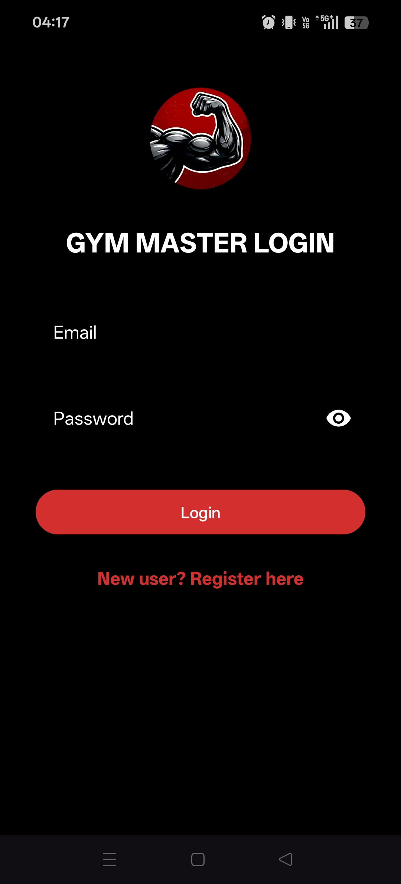
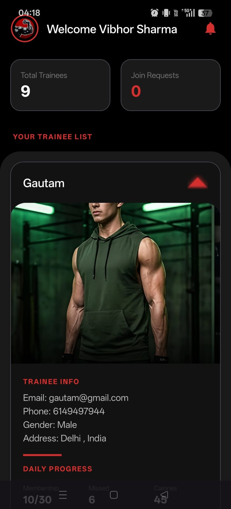
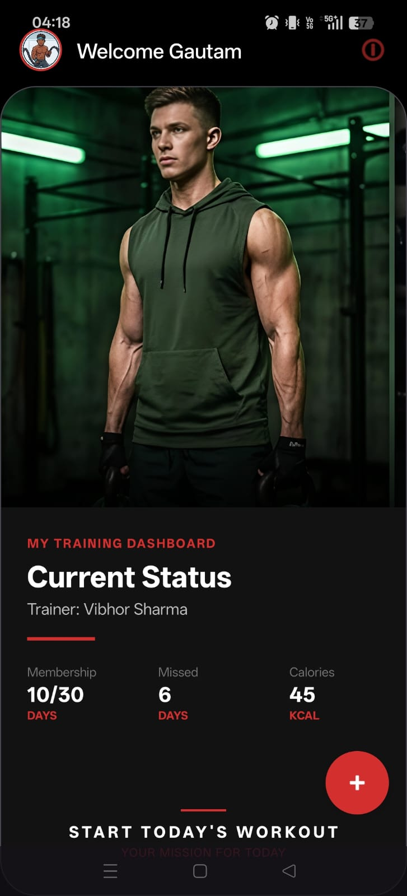

# 🏋️ Gym Management App (Red Vibe Edition)

A professional-grade Android application designed for gym management, featuring a sleek dark-themed UI with role-based access for **Gym Owners** and **Trainees**.

## 📱 Project Overview
This app bridges the gap between trainers and trainees using a local SQLite architecture. It allows owners to manage their client base through unique invite codes and provides trainees with a gamified dashboard to track their fitness journey.

## ✨ Key Features

### 👑 Owner Dashboard
- **Unique Code Generation:** Every owner gets a unique 6-digit code for trainee registration.
- **Trainee Management:** View a list of all joined trainees with custom expandable cards.
- **Progress Tracking:** Update trainee stats like Membership days, Missed days, Calories, and Workout time in real-time.
- **Notification System:** A dedicated request area to approve or deny new trainees.

### 👟 Trainee Dashboard
- **Dynamic Profile:** Personalized welcome screen with custom avatars (Titan, Warrior, Beast, etc.).
- **Health Hub:** Interactive "Indian Dish of the Day" and "Traditional Gym Routine" sections.
- **Live Stats:** Real-time view of workout progress assigned by the trainer.
- **Custom Avatars:** Choose from a set of professional gym avatars or upload from the gallery.

## 🛠️ Tech Stack
- **Language:** Java
- **UI Framework:** XML (Material Design 3)
- **Database:** SQLite (Local Persistence)
- **Components:** RecyclerView, ConstraintLayout, SharedPreferences, Custom Adapters.

## 📊 Project Stats
- **Total Lines of Code:** ~2,250
- **Architecture:** Local-first (SQLite)
- **UI Theme:** Dark/High-Contrast Red (#1A1A1A & @color/red)

## 📸 Screenshots
<table>
  <tr>
    <td></td>
    <td></td>
    <td></td>
  </tr>
</table>

## 🚀 How to Use
1. **Clone the repo:** `git clone https://github.com/VibhorShr/Gym_Management_App.git`
2. **Open in Android Studio:** Ensure you have the latest Arctic Fox or Giraffe version.
3. **Run:** Deploy on an emulator or physical device (Android 8.0+ recommended).

## 📝 Author
**Vibhor** - [GitHub Profile](https://github.com/VibhorShr)

